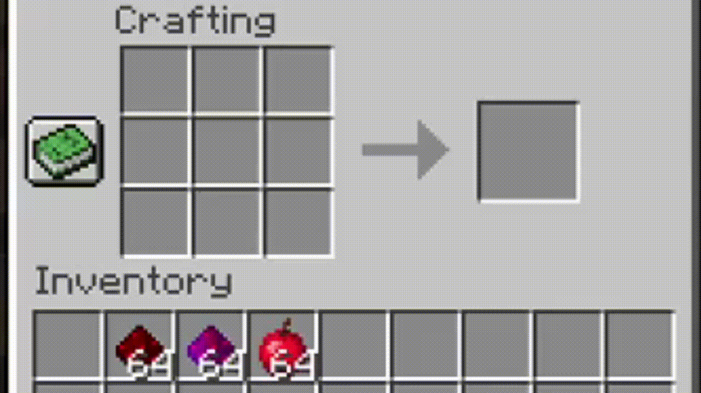
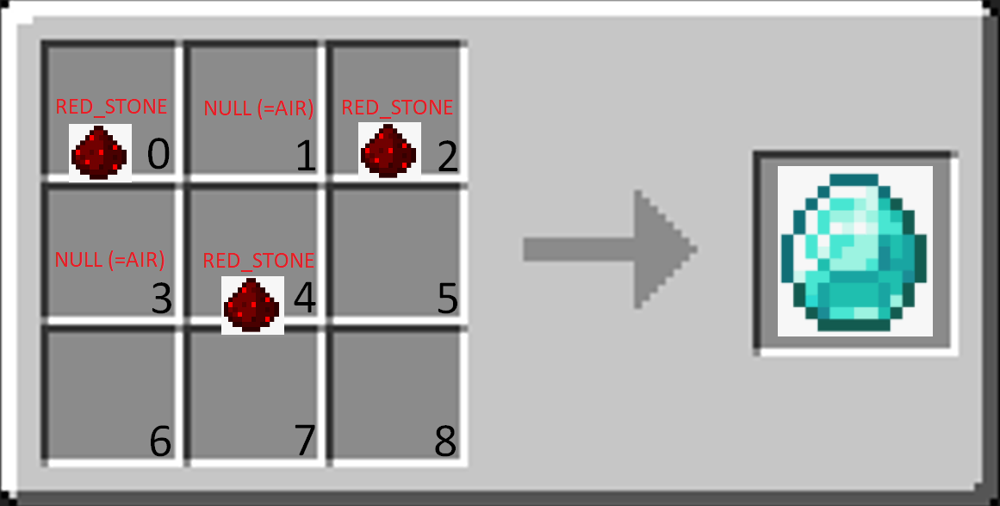

[](https://github.com/Nonopichy/CustomRecipe/releases/)


# FrameWork
* Version Support: **1.13.2** Below
* Frameworks: Bukkit, Lombok

### Craft with custom items
> 

### Only specific items to craft
> 

# Tutorial:
- Add [CustomRecipe.jar](https://github.com/Nonopichy/CustomRecipe/releases/) in libraries (how you add bukkit)
- In artifacts:
> 
- To stay like this:
> 

- Create a new instance of 'CustomRecipe' in your JavaPlugin (Main).
- Create a new instance of 'Recipe' add to 'CustomRecipe'.
- Execute method 'addRecipe' with the arguments.
- Compile your plugin with CustomRecipe.jar inside.
- :) Finish! Example? BELOW!

### Example Short:

- To empty spaces, use ```null``` instead ```new MatrixItem(new ItemStack(Material.AIR),SLOT)```
```java
CustomRecipe customRecipe = new CustomRecipe(JavaPlugin);
Recipe recipe = new Recipe();
recipe.setLoose(false);
recipe.setResult(new ItemStack(Material.DIAMOND));
        
final ItemStack REDSTONE = new ItemStack(Material.REDSTONE);
recipe.setRecipe(
     new MatrixItem(REDSTONE, 0),
     null,
     new MatrixItem(REDSTONE, 2),
     null,
     new MatrixItem(REDSTONE, 4)
);
     
customRecipe.addRecipe("REDSTONE_TO_DIAMOND", recipe);
```



### Example "Bigger":

```java
CustomRecipe customRecipe = new CustomRecipe(JavaPlugin);
Recipe recipe = new Recipe();
recipe.setLoose(false);
recipe.setResult(result);
        
recipe.setRecipe(
     new MatrixItem(red, 0),
     new MatrixItem(red, 1),
     new MatrixItem(red, 2),
     new MatrixItem(red, 3),
     new MatrixItem(new ItemStack(Material.APPLE), 4),
     new MatrixItem(red, 5),
     new MatrixItem(red, 6),
     new MatrixItem(red, 7),
     new MatrixItem(red, 8)
);
     
customRecipe.addRecipe("APPLE_REDSTONE", recipe);
```

### Items used:

```java
// Item Result
ItemStack result = new ItemStack(Material.APPLE);
ItemMeta itemMeta = result.getItemMeta();
itemMeta.setDisplayName("§cMaça de Redstone");
result.addUnsafeEnchantment(Enchantment.LUCK,1);
itemMeta.addItemFlags(ItemFlag.HIDE_ENCHANTS);
result.setItemMeta(itemMeta);

// Item Craft
ItemStack redstone = new ItemStack(Material.REDSTONE);
itemMeta = red.getItemMeta();
itemMeta.setDisplayName("§c§lRedstone");
redstone.addUnsafeEnchantment(Enchantment.LUCK,1);
itemMeta.addItemFlags(ItemFlag.HIDE_ENCHANTS);
redstone.setItemMeta(itemMeta);
```

### Result:


