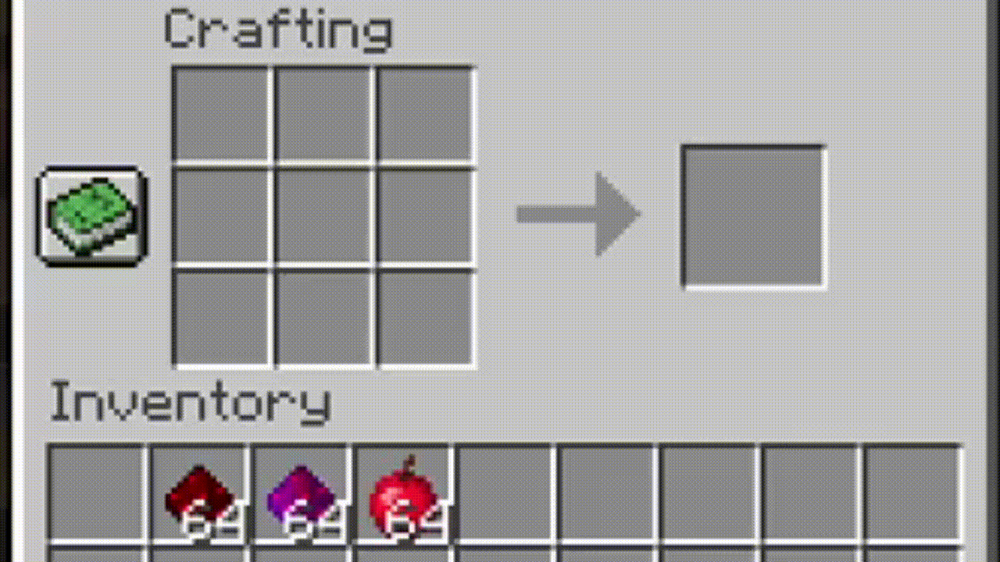

[](https://github.com/Nonopichy/Pokemon-Java/raw/master/build/Pokemon-Java.rar)
# CustomRecipe
* Version Support: **1.13.2** Below

### Craft with custom items


### Only specific items to craft


Example Usage:
```java
// Item Result
ItemStack result = new ItemStack(Material.APPLE);
ItemMeta m = result.getItemMeta();
m.setDisplayName("&cMaça de Redstone");
result.addUnsafeEnchantment(Enchantment.LUCK,1);
m.addItemFlags(ItemFlag.HIDE_ENCHANTS);
result.setItemMeta(m);

// Item Craft
ItemStack red = new ItemStack(Material.REDSTONE);
m = red.getItemMeta();
m.setDisplayName("&c&lRedstone");
result.setItemMeta(m);

CustomRecipe c = new CustomRecipe(this);
c.addRecipe("APPLE_REDSTONE",
     new CustomRecipe.Recipe(
          new CustomRecipe.MatrixItem[]{
               new CustomRecipe.MatrixItem(red,0),
               new CustomRecipe.MatrixItem(red,1),
               new CustomRecipe.MatrixItem(red,2),
               new CustomRecipe.MatrixItem(red,3),
               new CustomRecipe.MatrixItem(new ItemStack(Material.APPLE),4),
               new CustomRecipe.MatrixItem(red,5),
               new CustomRecipe.MatrixItem(red,6),
               new CustomRecipe.MatrixItem(red,7),
               new CustomRecipe.MatrixItem(red,8)
     },
result,false));
```
